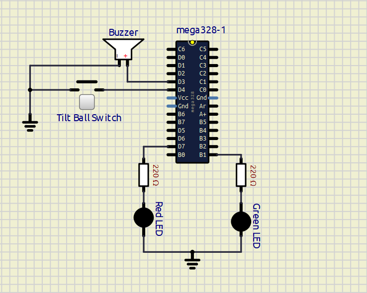
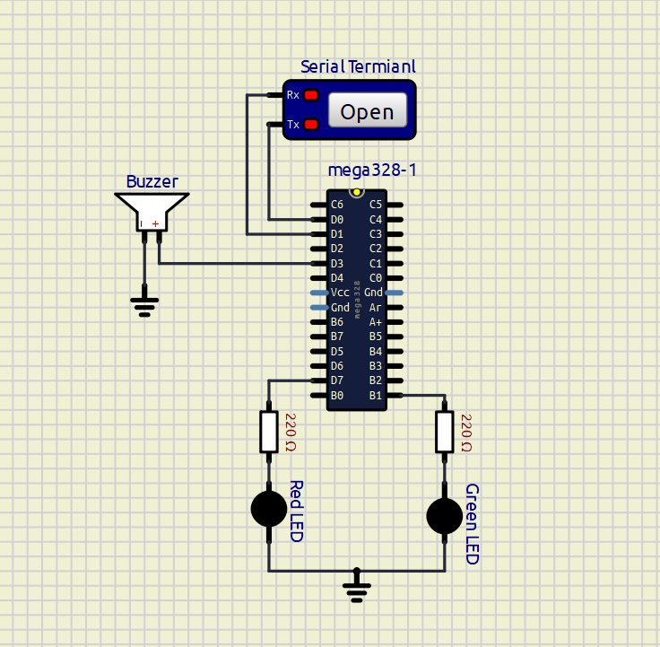
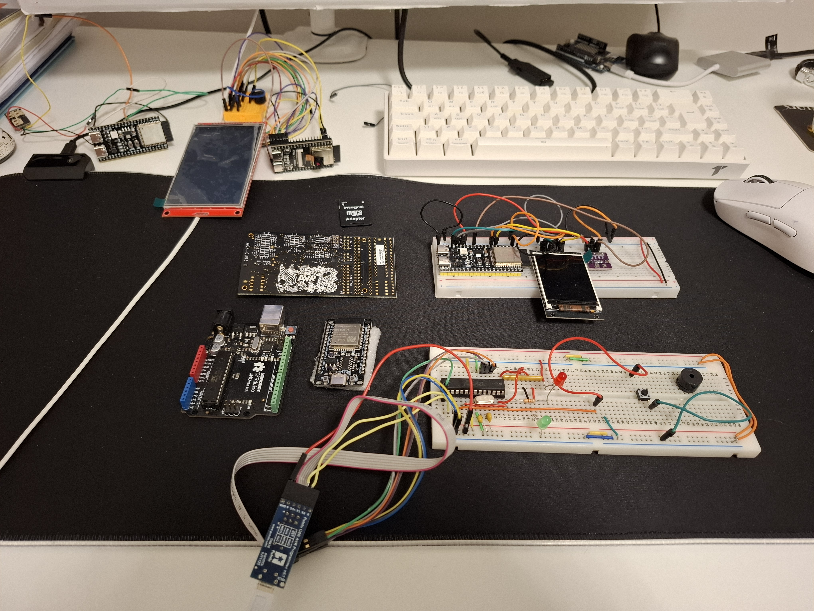

# Software for Embedded Systems (AVR)

This repository contains my coursework and projects from the **Software for Embedded Systems** module, focused on **bare-metal AVR programming**, **interrupts**, **hardware timers**, and **FreeRTOS** on the **ATmega328P**.

Each Continuous Assessment (CA) builds on the previous one, progressing from low-level hardware interaction to real-time operating system concepts.

All projects were developed in **C**, compiled using **avr-gcc**, and tested using **SimulIDE**, **AVR Dragon**, and **real hardware** where applicable.

> **Tip:** Click on any image below to watch the corresponding YouTube demonstration.

---

## Hardware & Tools Used

- **Microcontroller:** ATmega328P  
- **Programming Language:** C  
- **Toolchain:** avr-gcc, Makefiles, avrdude  
- **Debugging:** AVR Dragon, GDB  
- **Simulation:** SimulIDE  
- **RTOS:** FreeRTOS  

---

## CA Files Overview

---

### CA1 – Frequency Measurement Using Interrupts & Timers

**Description:**  
Measured the frequency of an external square-wave signal using hardware interrupts and Timer1 on the ATmega328P.  
Initial testing was done in SimulIDE, followed by validation on real hardware using a function generator.

**▶ Click the image below to watch the demo & explanation**

---

### CA2 – Race Conditions & False Positives  
*(Nuclear Reactor Simulation)*

**Description:**  
Demonstrated how race conditions between interrupt and non-interrupt code can produce false alarms.  
A simulated nuclear reactor system was used to reproduce and then fix concurrency bugs using atomic sections.

**▶ Click the image below to watch the demo & explanation**

---

### CA3 – Hidden Race Conditions at Assembly Level

**Description:**  
Showed that race conditions can still exist even when C code appears safe.  
Using the AVR Dragon and GDB, the false alarm was demonstrated at the **assembly level**.

**▶ Click the image below to watch the demo & explanation**

---

### CA4 – RTOS-Based Nuclear Reactor Simulation

**Description:**  
Re-implemented the nuclear reactor simulation using **FreeRTOS**, combining interrupts, tasks, and semaphores to safely manage shared resources.

**▶ Click the image below to watch the demo & explanation**

---

### CA5 – RTOS Queues (AVR Port)

**Description:**  
Ported an RTOS queue-based example from Shawn Hymel’s RTOS tutorial series (originally written for ESP32 + Arduino) to **bare-metal AVR** using **avr-gcc**.

**▶ Click the image below to watch the demo & explanation**

---

## Projects

---

### Tilty.c – Tilt-Activated Buzzer & LED Indicator

**Description:**  
An interrupt-driven tilt detection system using **INT0** on the **ATmega328P**.  
Each tilt event alternates LEDs and triggers a short buzzer tone using **Timer2 PWM**.

**▶ Click the image below to watch the video demo**

**Schematic:**  

---

### Alarm.c – Alarm System (USART Unlock)

**Description:**  
A simple AVR-based alarm system featuring alternating LEDs, a PWM-driven buzzer,  
and unlock control via **USART input**.

**▶ Click the image below to watch the video demo**

**Schematic:**  

---

## Full Video Playlist

> ▶ **Click the image below to view the full YouTube playlist**

---

## Topics & Skills Covered

Through this module, I gained hands-on experience with:

- Installing and working within a **Debian Virtual Machine**
- Testing embedded hardware using **SimulIDE**
- **USART communication** between a microcontroller and a terminal
- Using **interrupts** and writing **Interrupt Service Routines (ISRs)**
- **Hardware timers** on the ATmega328P and their practical uses
- Identifying **race conditions** in embedded systems
- Preventing race conditions using **atomic operations**
- Debugging embedded systems with the **AVR Dragon**
- Debugging C programs using **GDB**
- **FreeRTOS** fundamentals
- Core FreeRTOS components:
  - Tasks  
  - Scheduler  
  - Semaphores  
  - Mutexes  
  - Queues  
